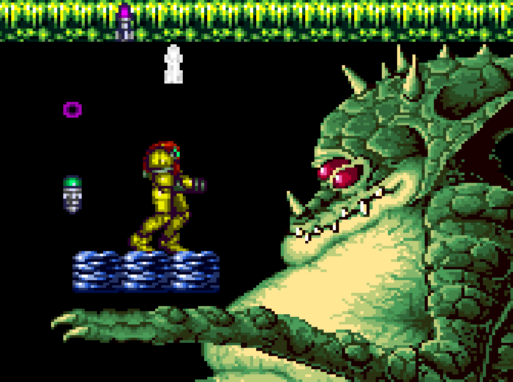

Baby Metroid
============

Baby Metroid is a new romhack for Super Metroid targeted at younger
players.  I wrote it for my son, who badly wanted to play but lacked the
experience to complete the full game on his own.

Story: The death of the Baby Metroid weighing on her conscience, Samus
Aran purchases a quantum time engine and uses it to travel back in time,
intending to defeat not only Mother Brain but also destiny itself.

The game is intended for children, but I have included some puzzles to
hopefully make the game interesting for adults too.

Features:

| &nbsp;&nbsp;&nbsp;&nbsp;&nbsp;&nbsp;&nbsp;&nbsp;&nbsp;&nbsp;&nbsp;&nbsp;&nbsp;&nbsp;&nbsp;&nbsp;&nbsp;&nbsp;&nbsp;&nbsp;&nbsp;&nbsp;&nbsp;&nbsp;&nbsp;&nbsp;&nbsp;&nbsp;&nbsp;&nbsp;&nbsp;&nbsp;&nbsp;&nbsp;&nbsp;&nbsp;&nbsp;&nbsp;&nbsp;&nbsp;&nbsp;&nbsp;&nbsp;&nbsp;&nbsp;&nbsp;&nbsp;&nbsp;&nbsp;&nbsp;&nbsp; | &nbsp; | &nbsp;&nbsp;&nbsp;&nbsp;&nbsp;&nbsp;&nbsp;&nbsp;&nbsp;&nbsp;&nbsp;&nbsp;&nbsp;&nbsp;&nbsp;&nbsp;&nbsp;&nbsp;&nbsp;&nbsp;&nbsp;&nbsp;&nbsp;&nbsp;&nbsp;&nbsp;&nbsp;&nbsp;&nbsp;&nbsp;&nbsp;&nbsp;&nbsp;&nbsp; |
| -------- | -------- | -------- |
|  |  |  |
| Statues of Samus Aran guide the player to hidden blocks | Single-button blue suit for players who have not yet learned how to use multiple buttons at once | Sticky morph ball makes navigating tough rooms easier and turns the game into a playground |
|  |  |  |
Colorized HUD so the item color matches the color of the door it opens. | Spikes and other scary/dangerous elements have been removed or modified to be less intimidating | New logic turns boss fights into puzzles |
